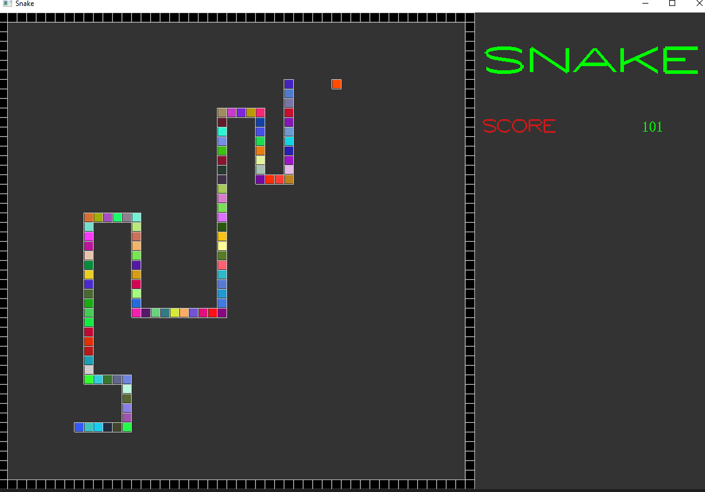

# Snake
## Simple OpenGL + C++ Minigame (2016)

## This project taught me:
* OOP
* Cross-Platform Programming
* OpenGL (immediate mode)
* Modern C++
* Source control

### Dependencies:
* OpenGL & GLUT

## Installation:
* On MacOS it's as simple as cloning this repository and running 'make' (assuming you have g++)
* On Windows, since the OS doesn't come with the dependencies, the easiest way to compile is to install them using 'vcpkg' and compiling with VS C++

